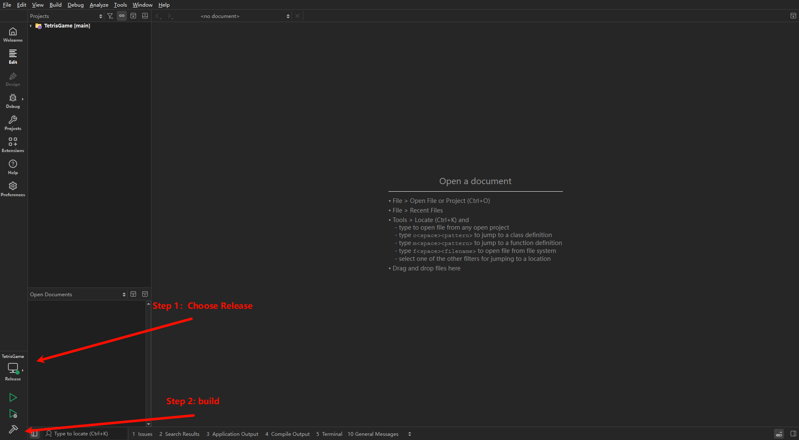
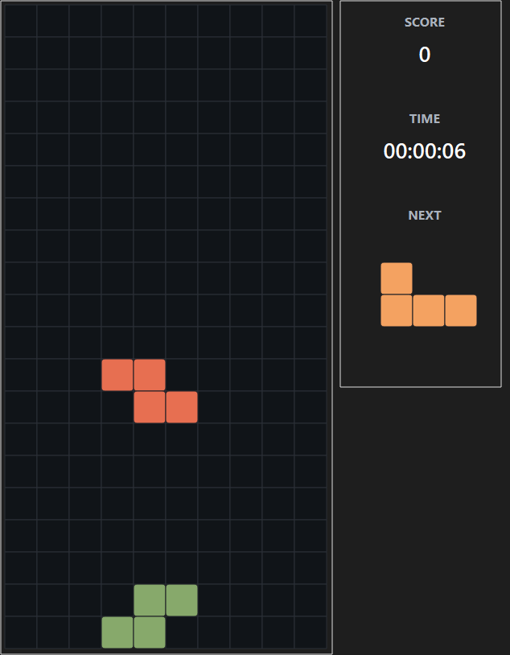
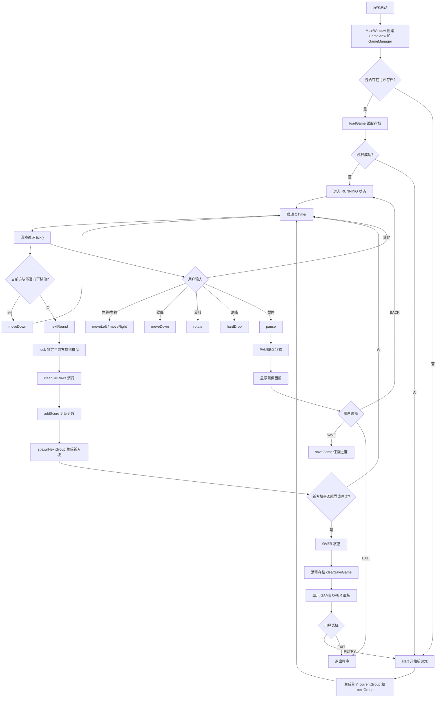
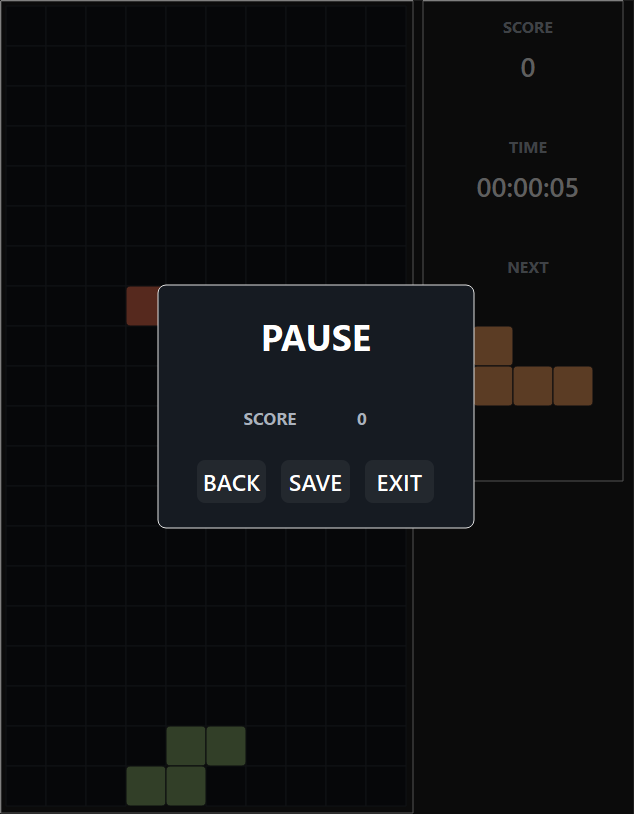
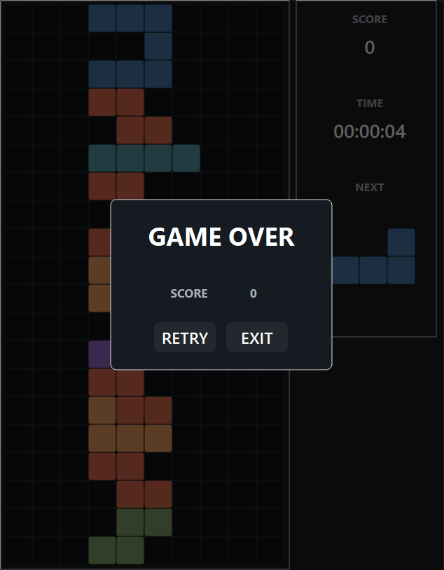

# Qt-Tetris

## 技术栈

- C++
- Qt
- cmake

## 构建方式

使用下面的命令克隆仓库

```bash
git clone git@github.com:Rotaxs/Qt-Tetris.git
```

**通过 Qt Creator 构建** 

打开 Qt Creator，按下快捷键 `Ctrl + O` 弹出打开文件的面板，选择仓库中的 `CMakeLists.txt` 文件，等待项目初始化

选择 `Release`，然后点击构建按钮即可

这时可以在项目的 `build` 目录下找到相应的 `exe` 文件



## 项目简介

本项目基于 Qt 开发，实现了一个简单的俄罗斯方块游戏

项目并非一比一复刻，例如

- 没有实现原版的等级机制
- 没有实现方块下落速度随着游戏进行不断加快



## 项目特色

- 实现简易存档功能
- UI 层和逻辑层解耦，层次清晰
- 所有控件均使用 `QPainter` 绘制

## 游戏玩法




**按键控制**

- `上/W`：方块旋转
- `下/S`：方块向下移动一格
- `左/A`：方块向左移动一格
- `右/D`：方块向右移动一格
- `SPACE`：方块直接落到底部
- `ESC/P`：暂停

**暂停界面**

暂停界面有三个按钮，分别是 `BACK`（返回游戏），`SAVE`（游戏存档），`EXIT`（退出游戏）



**游戏存档**

游戏的存档路径在 `C:\Users\username\AppData\Local\Tetris`

当游戏启动时，会首先读取存档，如果存档为空，则开始新的游戏；否则会读取存档中未结束的游戏继续游戏

如果游戏结束，会自动清空存档

**游戏结束**

游戏结束时会弹出游戏结束的面板，这里会有两个按钮 `RETRY`（重新开始），`EXIT`（退出游戏）


