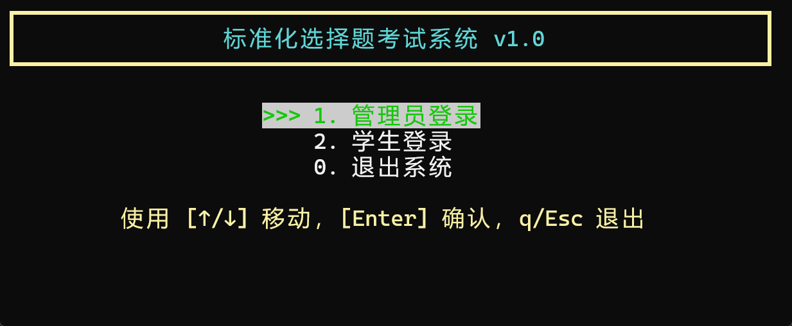
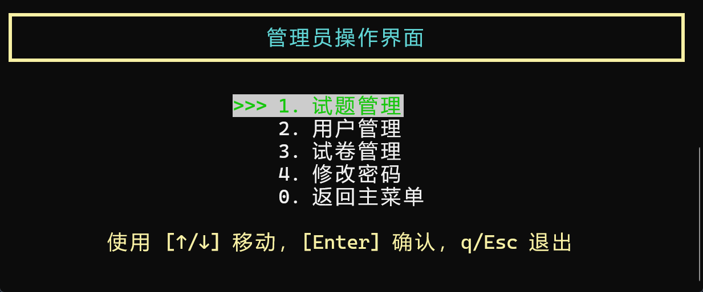
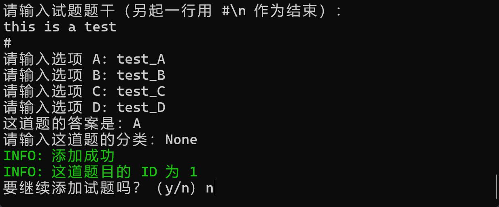
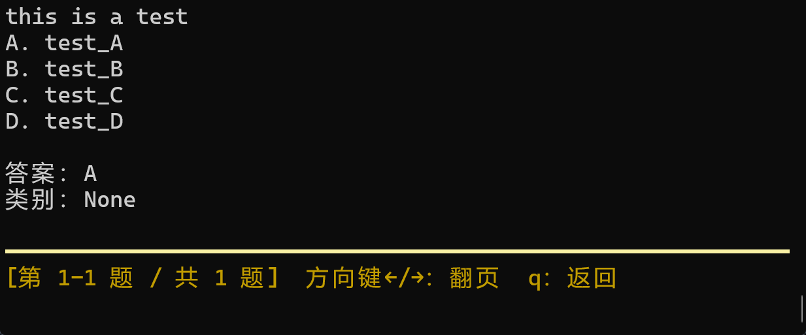
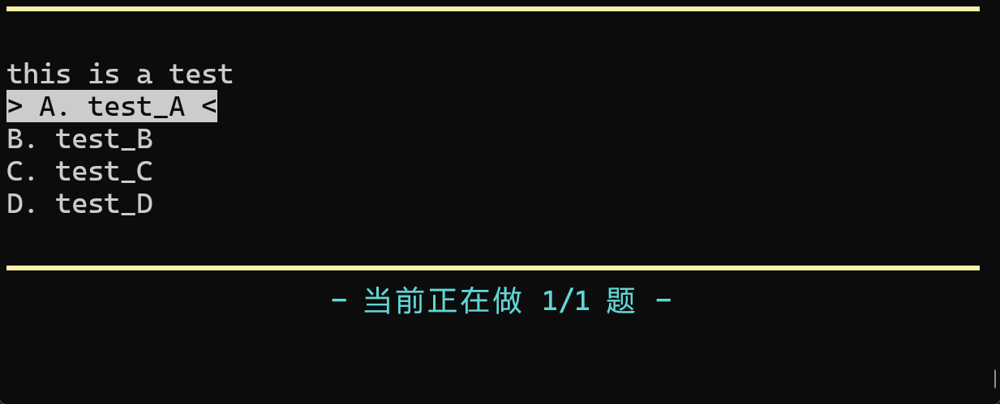

# single_choice_examination_system

## 项目介绍

这是一个使用 C 语言开发的 TUI 单选题考试系统，并使用 `unistd.h` 库实现了键盘响应







## 功能

主要实现了如下功能

- 登录与注册
- 管理员题库管理
- 学生练习与考试

具体功能如下

- 管理员（管理员默认密码为 123456789）
  - 试题管理
    - 试题添加
    - 试题删除
    - 试题修改
    - 试题检索
    - 试题浏览
  - 组卷
    - 组卷
      - 选题
      - 修改试卷信息和选题
      - 浏览当前试卷
      - 发布当前试卷
    - 浏览试卷
    - 编辑试卷
    - 删除试卷
    - 发布试卷
  - 用户管理
    - 添加用户
    - 删除用户
    - 修改用户信息
    - 查询用户的做题信息

- 普通用户
  - 练习功能
    - 用户指定题目数量，系统随机抽取相应数量的题目
    - 对于每一题，系统要检测是否正确，如果错误，要给出正确答案
    - 每写一题，给出一题答案
  - 考试功能
    - 根据管理员分发的试卷，在指定时间内可看到试题
    - 答题全部结束后才能看到答案和对应的得分
    - 答题设置记录功能，用户退出程序后下次答题从上次退出的位置继续答题
  - 修改密码

## 构建方式

手动编译

```bash
gcc ./*.c -o system.exe
```